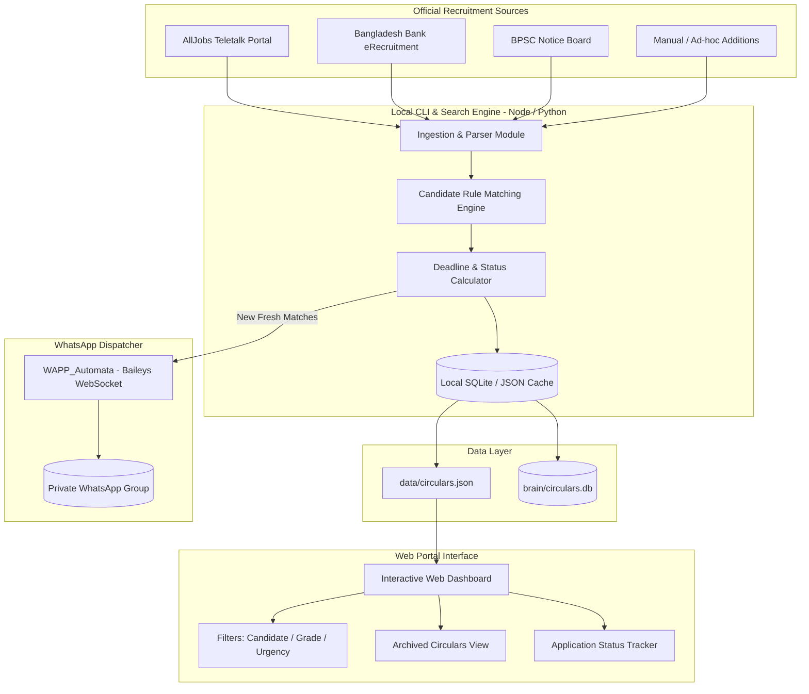

# Architecture Specification: Bubu-Dudu Job Circular Portal & Watchdog

## 1. System Vision & Objective
The **Job Circular Portal & Watchdog** is an integrated system designed to:
1. Aggregate live recruitment circulars across Bangladesh public and autonomous sectors (AllJobs Teletalk, Bangladesh Bank eRecruitment, BPSC, and major autonomous boards).
2. Match circulars against the exact academic qualifications of **Dudu (B.Sc. CSE)** and **Bubu (B.Sc. Agriculture)**.
3. Classify circulars by Grade (Grade 9 through Grade 16) and target organization type.
4. Calculate dynamic days-until-deadline countdowns and flag **Urgent Circulars (≤ 5 Days Remaining)**.
5. Automatically archive expired circulars (`current_date > deadline`) to keep the primary interface uncluttered.
6. Provide a modern, responsive Web Dashboard for desktop and mobile devices.
7. Dispatch scheduled WhatsApp digests to their private WhatsApp group via the local Baileys bridge (`WAPP_Automata`).

---

## 2. High-Level Architecture Diagram

---

## 3. Subsystem Breakdown

### 3.1 Ingestion & Parsing Subsystem
* **Source Adapters:**
  * **AllJobs Adapter:** Scrapes/fetches recent government circular entries from `alljobs.teletalk.com.bd`.
  * **Bangladesh Bank Adapter:** Scrapes `erecruitment.bb.org.bd` for AD, Senior Officer, and Officer recruitments.
  * **Manual Insertion Tool:** CLI prompt to paste any sudden newspaper or ministry notice link.
* **Normalization:** Standardizes raw announcements into the unified `JobCircular` schema.

---

### 3.2 Rules & Classification Engine
Evaluates post titles, educational requirements, and organizations against the candidate profiles:
* **Candidate Tagging Logic:**
  * **`DUDU`:** If requirements match CSE / IT / Software / Computer Science, or titles include `Assistant Programmer`, `IT Officer`, `Network Engineer`, `AME`, `Software Engineer`.
  * **`BUBU`:** If requirements match Agriculture / Agricultural Science / Botany / Plant Breeding / Soil Science, or titles include `Scientific Officer`, `SAAO`, `Agriculture Extension Officer`, `BINA/BARI/BRRI/BADC`.
  * **`BOTH`:** If requirements allow Any Discipline / General Graduate (e.g. Bangladesh Bank AD General, Combined Banks Senior Officer General, BCS General Cadres, Auditor, Computer Operator Grade 13 with B.Sc. Science, Youth Development UYDO).

---

### 3.3 Deadline & Lifecycle State Machine
* Dynamically calculates `days_remaining = deadline - today`.
* **State Lifecycle:**
  * **`URGENT`:** `0 <= days_remaining <= 5` (Trigger red badge, highlighted on top).
  * **`ACTIVE`:** `days_remaining > 5` (Standard active board listing).
  * **`ARCHIVED`:** `days_remaining < 0` (Automatically moved to Archive tab; removed from active board).
  * **`APPLIED`:** User marked the post as applied, attaching their User ID / Tracking ID.

---

### 3.4 Web Dashboard Architecture
* **Frontend Tech:** Lightweight React + Tailwind CSS dashboard (or standalone modern Single Page Application).
* **Key Components:**
  * **Hero Stats Bar:** Active Jobs Count, Expiring Soon Count (≤ 5 Days), Applied Count, Archived Count.
  * **Top Filter Bar:**
    * Person Tabs: `[All]`, `[💻 Dudu (CSE)]`, `[🌾 Bubu (Agri)]`, `[🤝 Both (Joint)]`.
    * Urgency Tabs: `[🔥 All Active]`, `[🚨 Closing in ≤ 5 Days]`, `[📦 Archived]`.
    * Grade Dropdown: Grade 9, Grade 10, Grade 11–13, Grade 14–16.
    * Organization Type: Banks, Ministries, Research (NARS), Defence, Local/Field.
  * **Circular Cards:**
    * Badge showing Grade & Organization.
    * Candidate match tag (`Dudu`, `Bubu`, or `Both`).
    * Countdown chip (e.g., `🔴 2 Days Left`, `🟢 14 Days Left`).
    * Buttons: `[📄 Official PDF]` and `[📝 Apply on Teletalk]`.
    * Action menu: `[Mark as Applied]` (prompt for tracking ID) or `[Bookmark]`.

---

### 3.5 WhatsApp Notification Bridge
* Integrates with [`WAPP_Automata`](file:///s:/Bubu-Dudu%20Job%20Gallary/WAPP_Automata) located right in the workspace.
* Uses the pre-authenticated session in `WAPP_Automata/.session/`.
* Dispatches formatted WhatsApp messages for:
  1. Fresh circulars matching Bubu or Dudu.
  2. 48-hour deadline warning reminders for unapplied saved jobs.
